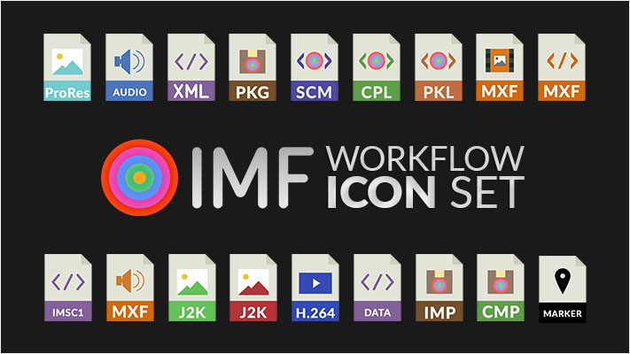

# IMF Icon set

A collection of graphical Icons used to denote the internal framework of the Interoperable Master Format, as used in the Essential Training - IMF course.

[Go to training course.](https://training.trenchdigital.net/imf)

## Meta

Distributed under the BSD 2-Clause License license. See ``LICENSE`` for more information.

[Github](https://github.com/trenchdigital) | [Website](https://trenchdigital.net) | [Contact](https://trenchdigital.net#contact)